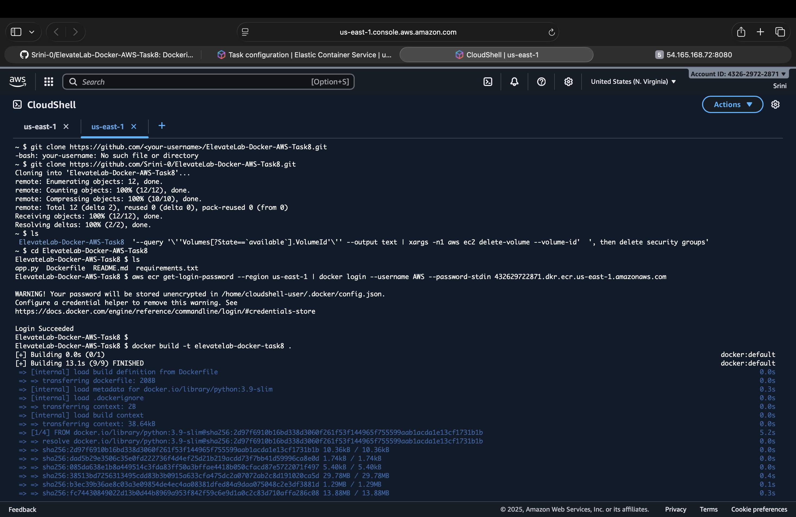
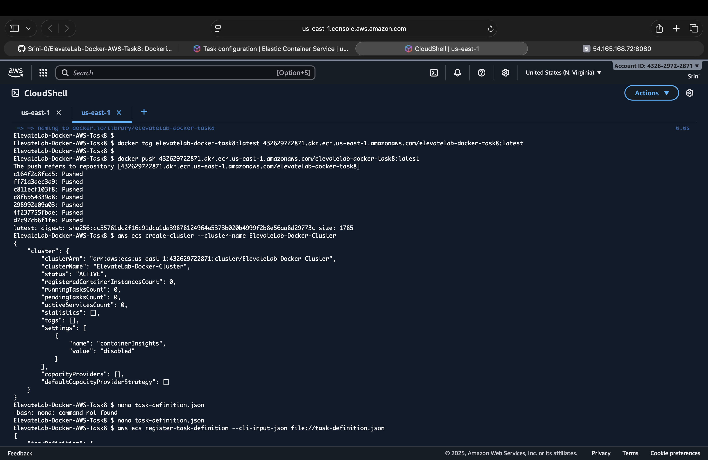
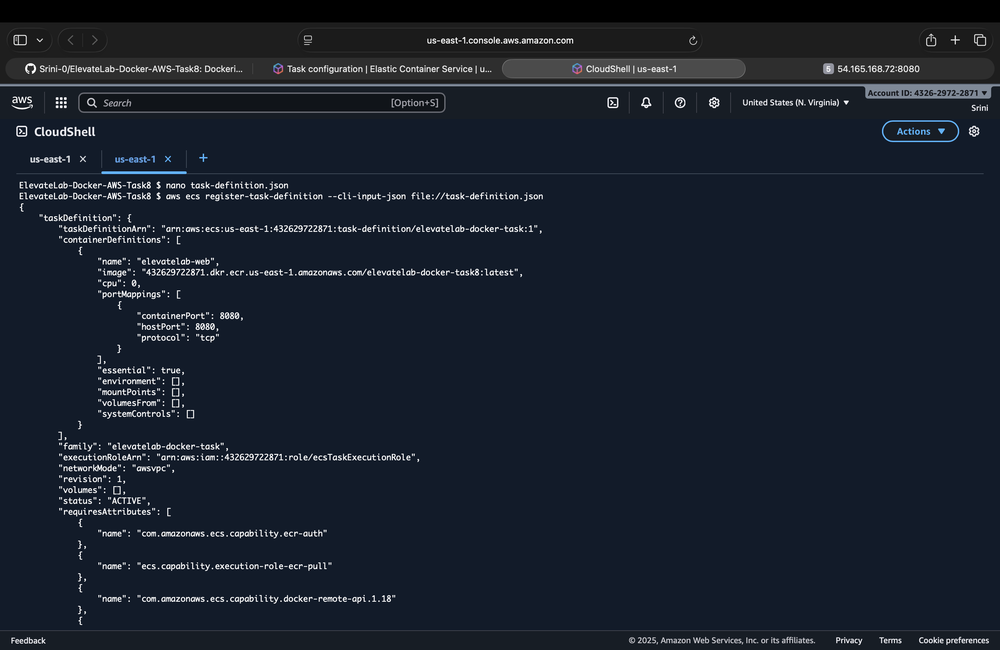
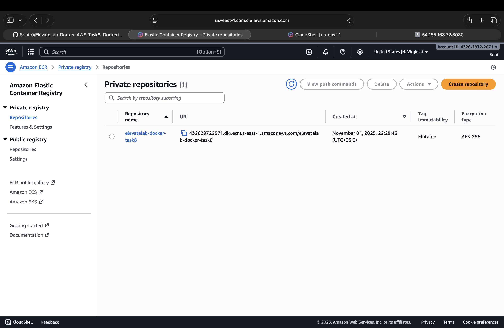
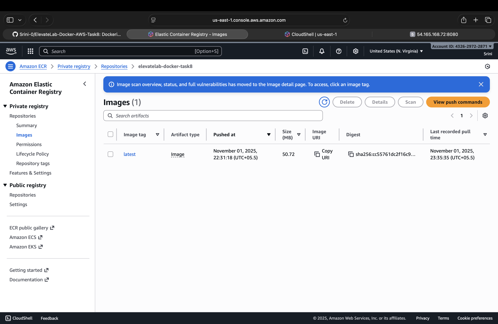
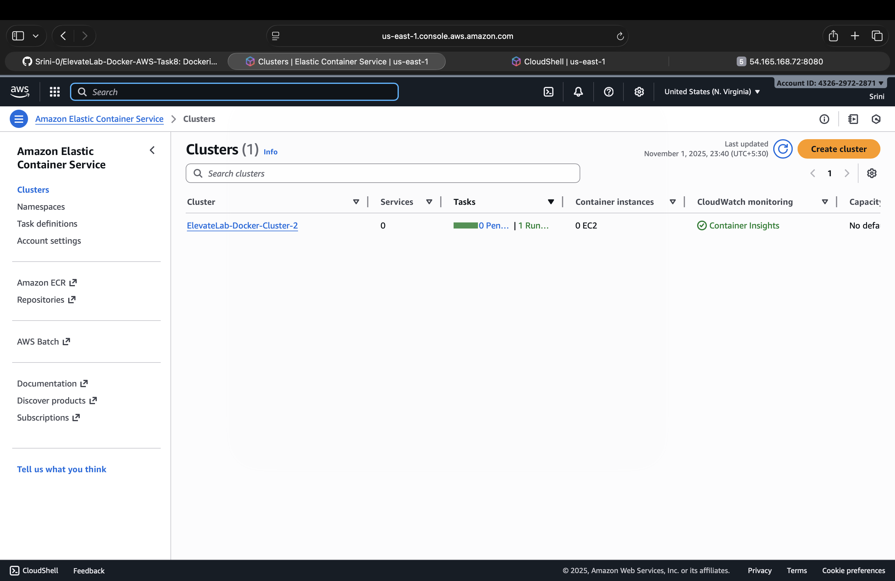
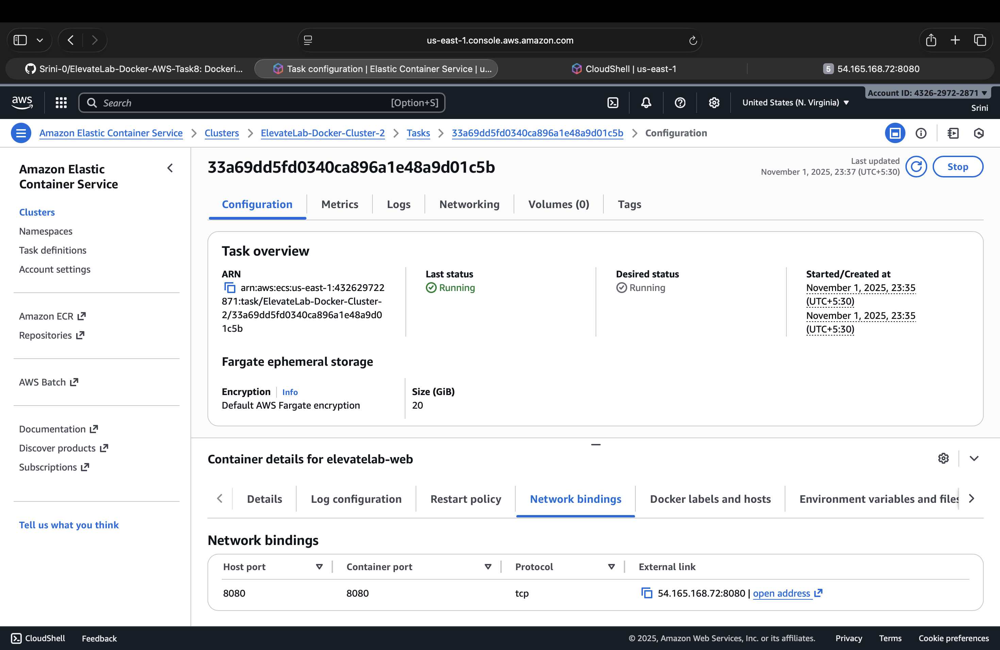
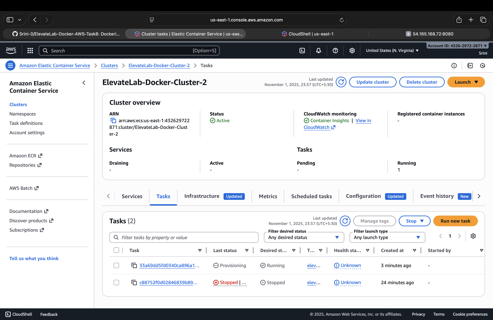
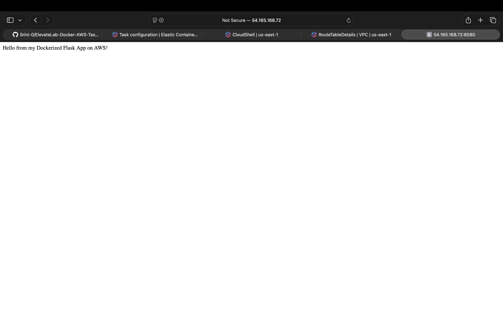

# ElevateLab Docker Deployment Task 8 — AWS ECS (Fargate)

## Objective
To deploy a **Dockerized Flask web application** on **AWS ECS (Fargate)** using a container image stored in **Amazon ECR**.  
This project demonstrates **containerization**, **cloud-native deployment**, and **scalable hosting** without managing servers manually.

---

## Learning Outcomes
By completing this task, you will:
- Understand **Docker containerization** and **image management**
- Push Docker images to **Amazon ECR (Elastic Container Registry)**
- Deploy containers using **AWS ECS Fargate**
- Configure **IAM roles**, **VPC networking**, and **security groups**
- Troubleshoot ECS tasks, permissions, and network issues

---

## Tools & Resources Used

| Tool / Service | Purpose |
|----------------|----------|
| **Docker** | Containerization and image building |
| **Amazon ECR** | Image repository for Docker containers |
| **AWS ECS (Fargate)** | Run containers serverlessly |
| **AWS IAM** | Manage task roles and permissions |
| **Amazon VPC** | Provide networking for ECS |
| **AWS CloudShell / EC2** | Local environment for Docker commands |
| **Flask (Python)** | Simple web framework for demo app |

---

## Step-by-Step Implementation

### **Step 1 — Create a Simple Flask App**

**app.py**

```python
from flask import Flask
app = Flask(__name__)

@app.route('/')
def home():
    return "Hello from my Dockerized Flask App on AWS!"

if __name__ == '__main__':
    app.run(host='0.0.0.0', port=8080)
```

**Screenshort:**



---

### **Step 2 — Create Dockerfile**

```
FROM python:3.9-slim
WORKDIR /app
COPY . .
RUN pip install -r requirements.txt
EXPOSE 8080
CMD ["python", "app.py"]
```

**Build and test locally:**

```
docker build -t elevatelab-docker-task8 .
docker run -p 8080:8080 elevatelab-docker-task8
```

**Screenshort:**



---

### **Step 3 — Push Image to Amazon ECR**

```
# Authenticate Docker to AWS ECR
aws ecr get-login-password --region us-east-1 | \
docker login --username AWS --password-stdin 432629722871.dkr.ecr.us-east-1.amazonaws.com

# Tag & push image
docker tag elevatelab-docker-task8:latest 432629722871.dkr.ecr.us-east-1.amazonaws.com/elevatelab-docker-task8:latest
docker push 432629722871.dkr.ecr.us-east-1.amazonaws.com/elevatelab-docker-task8:latest
```

**Screenshort:**







---

### **Step 4 — Create ECS Cluster**

1. Go to **ECS Console → Clusters → Create Cluster**
2. Launch type: Fargate
3. Name: ElevateLab-Docker-Cluster-2

**Screenshort:**



---

### **Step 5 — Create IAM Role**

1. IAM → Roles → Create Role
2. Trusted entity: ECS Task
   Policies:
   -AmazonECSTaskExecutionRolePolicy
   -AmazonEC2ContainerRegistryReadOnly
3. Name: ecsTaskExecutionRole

---

### **Step 6 — Create Task Definition**

**ECS → Task Definitions → Create new**
1. Launch type: Fargate
2. Name: elevatelab-docker-task8
3. Task role: ecsTaskExecutionRole
4. Container name: elevatelab-docker-task8
5. Image URI: 432629722871.dkr.ecr.us-east-1.amazonaws.com/elevatelab-docker-task8:latest
6. Port: 8080
7. CPU: 0.25 vCPU
8. Memory: 512 MB

**Screenshort:**



---

### **Step 7 — Configure Networking (VPC, Subnet, Security Group)**

VPC / Subnet
- Use a **public subnet** with Auto-assign *Public IP: Enabled*
- Ensure an Internet Gateway is attached with route 0.0.0.0/0 → IGW
Security Group
- Inbound rule: TCP 8080 from 0.0.0.0/0
- Outbound: All traffic allowed

---

### **Step 8 — Run ECS Task**

**ECS → Cluster → Run New Task**
1. Launch type: Fargate
2. Task definition: elevatelab-docker-task8
3. Cluster: ElevateLab-Docker-Cluster
4. Subnet: your public subnet
5. Auto-assign Public IP: ✅ Enabled
6. Security Group: Allow 8080
✅ Once status shows RUNNING, open the Public IP in browser.

**Screenshort:**



---

### **Step 9 — Verify Deployment**

Visit:
```
http://<public-ip>:8080
```

**Screenshort:**



---
```
[Local System] → [Docker Build] → [Push to Amazon ECR]
             ↓
        [AWS ECS Fargate]
             ↓
        [Public IP / Browser Access]
```
